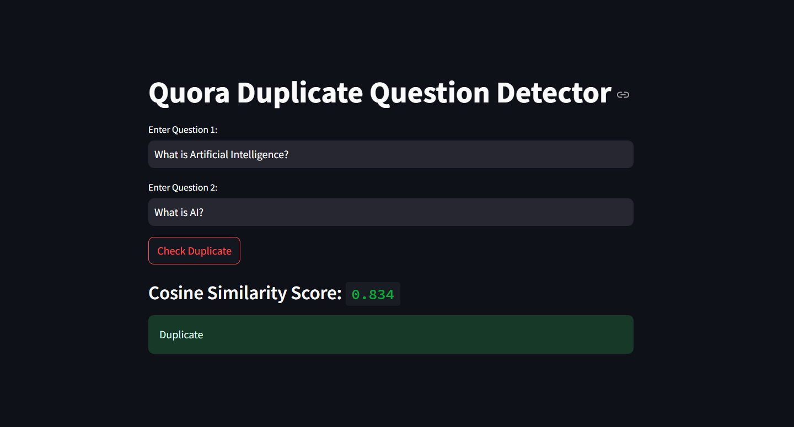
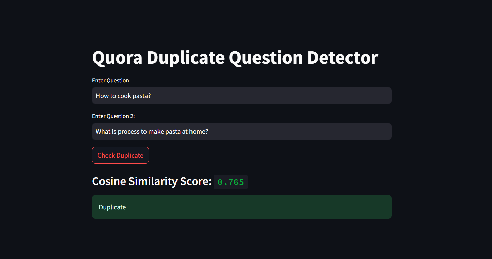

# Quora Duplicate Question Detection

## 📌 Project Overview

This project aims to detect duplicate question pairs on Quora using both traditional NLP methods and transformer-based sentence embeddings. Inspired by the Kaggle competition and built over two weeks, it showcases iterative improvements from Bag-of-Words models to semantic similarity via pretrained transformers, highlighting performance and interpretability trade-offs.

---

## 📌 Problem Statement

Given two questions, determine whether they are semantically similar (i.e. duplicates) or not.

---

## 📌 Dataset

- Source: Kaggle Quora Question Pairs Dataset
- Total Questions: 404,000+
- For BoW models, 50,000 samples were used due to memory limitations
- Full dataset was used for the transformer-based model


---

## 📌 Approaches & Techniques

### 1. BoW without Feature Engineering

- Used `CountVectorizer` directly on `question1` and `question2`
- No text cleaning or preprocessing applied
- Trained using:
  - Random Forest → Accuracy: 0.750
  - XGBoost → Accuracy: 0.738

---

### 2. BoW with Basic Feature Engineering

Seven basic features were engineered to provide more structural information about the questions:

- `q1_len` and `q2_len`: Length of question 1 and 2 (character count)
- `q1_word_count` and `q2_word_count`: Number of words in both questions
- `common_words`: Count of overlapping words between both questions
- `total_words`: Total unique words in both questions combined
- `word_share`: Ratio of common words to total unique words

These features, when combined with CountVectorizer output, showed improved performance:
- Random Forest → 0.770
- XGBoost → 0.771


---

### 3. BoW with Advanced Feature Engineering

To enhance lexical-based modeling, 21 hand-crafted features were engineered across three categories:

* **Token-Based**: Ratios of common/non-common words (stopwords & non-stopwords), and match indicators for first/last words.
* **Length-Based**: Length difference, mean length, and longest common substring ratio.
* **Fuzzy Matching** (via `fuzzywuzzy`): `fuzz_ratio`, `partial_ratio`, `token_sort_ratio`, `token_set_ratio`.

Combined with `CountVectorizer`, these features improved results:

* Random Forest → **0.800**
* XGBoost → 0.797

**Limitations**:
Despite better performance, the model still relied heavily on lexical overlap, struggled with semantically similar but differently worded questions, and involved heavy manual engineering.


These limitations highlighted the need for semantic embeddings, leading to Transformer-based modeling.

---

### 4. Transformer-Based Semantic Embedding

To overcome BoW’s lexical limitations, we used Hugging Face’s `paraphrase-MiniLM-L6-v2` model via `sentence-transformers` to generate dense semantic embeddings.

* Embeddings for both questions were passed to XGBoost
* Trained on full dataset (400K+ samples)
* Achieved accuracy: **0.841**

### Cosine Similarity for Final Prediction

Instead of relying solely on XGBoost, final predictions were made using cosine similarity:

* **Similarity ≥ 0.75** → Duplicate
* **< 0.75** → Not Duplicate

This approach handled semantically equivalent questions like
*“What is Artificial Intelligence?” ↔ “What is AI?”* with high precision.




---

## 📌 Streamlit Web Application

A simple and intuitive **Streamlit** interface lets users input two questions and instantly get:

* **Cosine similarity score**
* **Prediction**: Duplicate / Not Duplicate
* Powered by `all-MiniLM-L6-v2` embeddings + cosine similarity

This interface demonstrates real-time semantic matching beyond lexical overlap, handling paraphrased questions effectively.



---

## 📌 Technologies Used

| Category           | Tools & Libraries                                          |
| ------------------ | ---------------------------------------------------------- |
| **Modeling**       | `scikit-learn`, `XGBoost`, `pickle`                        |
| **NLP & Features** | `CountVectorizer`, `fuzzywuzzy`, `nltk`, `regex`, `string` |
| **Embeddings**     | `sentence-transformers` (`all-MiniLM-L6-v2`)               |
| **Visualization**  | `matplotlib`, `seaborn`                                    |
| **Deployment**     | `Streamlit` for web UI                                     |

---

## 📌 Run Locally

1. Clone the repository  
```bash
git clone https://github.com/AnuragValhe/Quora-Duplicate-Question-Detection.git
cd Quora-Duplicate-Question-Detection
````

2. Install dependencies

```bash
pip install -r requirements.txt
```

3. Run the Streamlit app

```bash
streamlit run app.py
```
---


