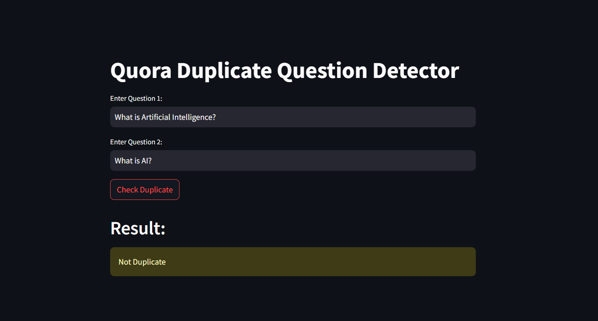

# Quora Duplicate Question Detection

## 📌 Project Overview

This project focuses on identifying whether two Quora questions are duplicates or not. The idea originated from my habit of reading Quora regularly since my JEE days. While diving deeper into data science, I discovered that Quora once hosted a Kaggle competition related to NLP,for finding duplicate questions pair. I studied the dataset, went through various kernels, and decided to build my own approach using both traditional NLP techniques and transformer-based models.

This project took over two weeks to build and includes multiple iterations, starting from simple Bag of Words (BoW) techniques to advanced sentence embeddings using transformer models. The goal was to explore how traditional and semantic techniques differ in handling such tasks and to build a robust, efficient system for detecting duplicates.

---

## 📌 Problem Statement

Given two questions, determine whether they are semantically similar (i.e. duplicates) or not.

---

## 📌 Dataset

- Source: Kaggle Quora Question Pairs Dataset
- Total Questions: 404,000+
- For BoW models, 50,000 samples were used due to memory limitations
- Full dataset was used for the transformer-based model

---

## 📌 Approaches & Techniques

### 1. BoW without Feature Engineering

- Used `CountVectorizer` directly on `question1` and `question2`
- No text cleaning or preprocessing applied
- Trained using:
  - Random Forest → Accuracy: 0.750
  - XGBoost → Accuracy: 0.738

---

### 2. BoW with Basic Feature Engineering

Seven basic features were engineered to provide more structural information about the questions:

- `q1_len` and `q2_len`: Length of question 1 and 2 (character count)
- `q1_word_count` and `q2_word_count`: Number of words in both questions
- `common_words`: Count of overlapping words between both questions
- `total_words`: Total unique words in both questions combined
- `word_share`: Ratio of common words to total unique words

These features, when combined with CountVectorizer output, showed improved performance:
- Random Forest → 0.770
- XGBoost → 0.771

---

### 3. BoW with Advanced Feature Engineering

This version used a comprehensive set of 21 features, categorized into token-based, length-based, and fuzzy string matching features:

**Seven Token-Based Features:**
- `cwc_min`, `cwc_max`: Ratio of common non-stopwords to min/max word count
- `csc_min`, `csc_max`: Ratio of common stopwords to min/max word count
- `ctc_min`, `ctc_max`: Ratio of total common tokens to min/max word count
- `last_word_eq`, `first_word_eq`: Boolean flags for whether first/last words are equal

**Three Length-Based Features:**
- `abs_len_diff`: Absolute difference in lengths
- `mean_len`: Mean of the two question lengths
- `longest_substr_ratio`: Ratio of longest common substring length to min length

**Four Fuzzy Features:**
Extracted using the `fuzzywuzzy` library for string similarity:
- `fuzz_ratio`
- `fuzz_partial_ratio`
- `token_sort_ratio`
- `token_set_ratio`

These features were combined with CountVectorizer vectors and the models were retrained:
- Random Forest → 0.800
- XGBoost → 0.797

Confusion matrix analysis showed that Random Forest had fewer false predictions.

### Limitations of BoW with Advanced Features

While BoW with advanced features performed well, it still had key limitations:

- It relied heavily on lexical overlap — it could not fully capture semantic meaning.
- Missed many real duplicate questions which had little word overlap but similar meanings.
- Required extensive manual feature engineering and preprocessing.
- Model performance plateaued at ~0.80 accuracy even after enhancements.

  

These challenges made it clear that a more **semantic understanding** of the questions was needed, which led to the next approach using transformer-based sentence embeddings.

---

### 4. Sentence Embedding using Transformer (Pre-Trained Model)

To address the limitations of BoW models, we used sentence embeddings from Hugging Face’s `sentence-transformers` library.

- Model used: `paraphrase-MiniLM-L6-v2`
- Embeddings generated for both questions and passed to XGBoost
- Trained on the full dataset (400,000+ rows)
- Achieved accuracy: 0.841

### Final Prediction via Cosine Similarity:

Instead of using the model directly, we use cosine similarity between question embeddings to make final predictions:
- If cosine similarity ≥ 0.75 → Duplicate
- Else → Not Duplicate

This method significantly improved performance on semantically similar questions like:
- “What is Artificial Intelligence?” and “What is AI?” → Correctly predicted as Duplicate

---

## 📌 Streamlit Web Application

The duplicate question detection system is deployed through an intuitive web interface built using **Streamlit**. The web app allows users to enter two different questions and simply click the **“Check”** button to receive a prediction on whether the questions are semantically similar (i.e., duplicates) or not.

**Transformer Embedding + Cosine Similarity:**

   * Utilizes a pretrained Sentence Transformer (`all-MiniLM-L6-v2`) to generate semantic embeddings.
   * Measures cosine similarity between the two question embeddings.
   * If similarity > 0.75, the questions are predicted as duplicate.
   * This version overcomes BoW model limitations by better capturing semantic meaning, even when phrasing differs.

To enhance user experience, app also display:

* Cosine Similarity Score
* Prediction Result (`Duplicate` or `Not Duplicate`)
* Clean and user-friendly layout with input fields and single-click evaluation

---

## 📌 Technologies & Libraries Used

* **Scikit-learn** – For model training (Random Forest, XGBoost), evaluation, and vectorization (CountVectorizer).
* **XGBoost** – Gradient boosting algorithm for better performance on large datasets.
* **FuzzyWuzzy** – For generating fuzzy matching features (like token sort ratio, partial ratio, etc.).
* **Sentence Transformers** – Used Hugging Face’s `all-MiniLM-L6-v2` model to generate dense semantic embeddings of questions.
* **NLTK / Regex / Python’s string functions** – Used in text preprocessing and feature engineering.
* **Matplotlib**, **Seaborn** – For visualizing feature distributions and model insights.
* **Streamlit** – To build and deploy the web application interface.
* **Pickle** – To save and load ML models and vectorizers for inference.

